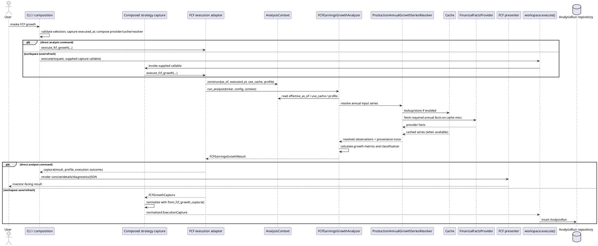

# Analysis Strategy Contributor Guide

This guide orients contributors who want to add a deterministic financial analysis strategy. It describes the current extension points without prescribing a fixed file layout or coding recipe.

## What an analysis strategy is

An analysis strategy is a named, deterministic method that resolves the evidence it needs, applies explicit financial rules in Python, and returns a typed result. Strategies may have different inputs, policies, calculations, and result models while sharing application infrastructure.

The [user-facing strategy guides](../user/strategies/README.md) explain the behavior and limitations of implemented strategies. This guide focuses on how they fit into the code.

## The current analyzer contract

[`BaseAnalyzer`](../../src/analysis/base_analyzer.py) is an abstract generic contract, `BaseAnalyzer[ConfigT, ResultT]`. Its `run_analysis(ticker, config, context)` method accepts a strategy-owned configuration and the shared `AnalysisContext`, and returns that strategy's typed result. The type variables are intentionally unconstrained: configuration may be a Pydantic model, frozen dataclass, or another typed shape. The base contract does not implement input resolution, provider access, presentation, or persistence.

All current strategy analyzers inherit from `BaseAnalyzer` with their own configuration and result types. The common interface does not make their calculation semantics or result models interchangeable.

`AnalysisContext` is the frozen per-run value object for cross-cutting execution concerns:

- `as_of` is the requested point-in-time boundary, or `None` when the caller did not request one. It is not replaced with a fabricated historical date.
- `executed_at` is the timezone-aware execution clock captured once by the caller for the analysis run. For a historical analysis it remains distinct from `as_of`: point-in-time admissibility uses `effective_as_of`, while cache freshness is judged against when the run executed.
- `effective_as_of` is a derived property: the requested `as_of` when present, otherwise `executed_at`. Analysis-layer data must respect this cutoff.
- `use_cache` is the run-wide permission governing cache reads and writes used by the analysis.
- `instrument_profile` carries the run's identity evidence. It is retained in results even when the calculation does not consult it.

The workspace selections expose `to_analysis_context(executed_at, instrument_profile)` alongside method-specific config conversion. Direct execution adapters and orchestrator handlers construct this context at their execution boundary. See [`AnalysisSelection` and its method-specific request models](../../src/workspace/requests.py) for the workspace request boundary. The [Architecture](ARCHITECTURE.md) documents broader boundaries and rationale.

## How a strategy runs

An invocation begins in CLI or orchestrator composition, which validates the method-specific selection and composes the provider, cache, resolver, and adapter dependencies. The adapter prepares the run's config and `AnalysisContext`, invokes the analyzer, and packages the native result with its profile and normalized execution outcome. A direct command presents that result. In the workspace flow, a capture callable returns a normalized capture to common `workspace.execute()`, which records envelope timing, encodes native evidence, constructs an `AnalysisRun`, and inserts it through the run repository.

The adapter connects a method to execution capture; it does not duplicate its financial rules. Common workspace execution owns the shared run envelope and persistence boundary; it does not calculate strategy metrics or reclassify the financial result.

### Strategy integration architecture

The diagram shows current FCF-growth wiring as a concrete path through the common analyzer contract. The strategy supplies its own config, resolver, calculations, and result; composition supplies the context and shared infrastructure.

```plantuml
@startuml
left to right direction
skinparam componentStyle rectangle

component "CLI / workspace composition" as CLI
component "FCF growth execution adapter" as Adapter
component "BaseAnalyzer[ConfigT, ResultT]" as Contract
component "AnalysisContext\nas_of · executed_at · use_cache · profile" as Context
component "FCFEarningsGrowthAnalyzer" as Analyzer
component "FCFEarningsGrowthConfig\n(policy · currency · provider)" as Config
component "ProductionAnnualGrowthSeriesResolver" as Resolver
component "FinancialFactsProvider" as Provider
component "Resolved-input series cache\n(optional)" as Cache
component "FCFEarningsGrowthResult\n+ ResolvedInput provenance" as Result
component "Strategy presentation" as Presentation
component "Capture normalization\nfrom_fcf_growth_capture()" as Normalize
component "Common workspace.execute()" as Workspace
database "AnalysisRun repository\n+ durable AnalysisRun" as Persistence

CLI --> Adapter : compose dependencies / invoke
Adapter --> Context : construct per-run context
Adapter --> Analyzer : ticker, config, context
Contract <|-- Analyzer
Config --> Analyzer
Context --> Analyzer
Analyzer --> Resolver : resolve annual evidence
Resolver --> Cache : read/write when enabled
Resolver --> Provider : provider facts
Resolver --> Analyzer : observations + trace
Analyzer --> Result : deterministic calculation
Result --> Presentation : direct command rendering
Adapter --> Normalize : FCFGrowthCapture
Normalize --> Workspace : ExecutionCapture
Workspace --> Persistence : normalized, encoded run
Result --> Workspace : native evidence in capture
@enduml
```

**What the contributor owns:** strategy policy/configuration, required input semantics and resolution, deterministic calculations, typed result, tests, user-facing presentation where needed, and its execution-adapter integration. **What is shared:** provider/cache contracts, provenance values, workspace execution, run persistence, and shared financial conventions. Reuse the shared boundaries instead of rebuilding them inside a strategy.

### What happens during an FCF & Earnings Growth run

At the composition boundary, the CLI or another caller may supply the capture callable. Common workspace execution invokes that callable through its interface and does not depend on the CLI implementation.

`FCFEarningsGrowthAnalyzer` implements `BaseAnalyzer[FCFEarningsGrowthConfig, FCFEarningsGrowthResult]`; the sequence shows the per-run interactions after composition.

The direct command and workspace save/refresh paths reuse the method adapter, but the common persistence wrapper is only involved when an Analysis Run is being recorded. A financially negative screen can still have a completed execution outcome; the strategy's classification and software run status answer different questions.

## Where financial data comes from

The strategy determines which financial capability its semantics require. FCF growth uses a `FinancialFactsProvider` through its production annual-series resolver, currently backed by SEC EDGAR for the required completed annual cash-flow and EPS facts. The resolution layer can use an optional cache and returns typed inputs with source, period, availability, retrieval, and transformation lineage. Historical prices, company financial facts, quotes, and macro observations are distinct capabilities; do not treat one as a substitute for another.

`use_cache` controls whether the resolver can use its configured resolved-input cache. Provider and cache composition belongs at the application boundary. Detailed financial definitions, conventions, and data limitations belong in [Financial Math & Data Conventions](../user/FINANCE_MATH.md) and the relevant [strategy guide](../user/strategies/FCF_EARNINGS_GROWTH.md).

## How inputs and provenance are handled

An input resolver turns provider evidence into strategy-appropriate typed observations. For FCF growth, `ProductionAnnualGrowthSeriesResolver` selects compatible, contiguous annual evidence under the requested `as_of`, records a `ResolutionTrace`, and returns annual observations whose component values retain `ResolvedInput` provenance. The analyzer consumes the resolved assembly; it does not fetch from providers itself.

Keep missing, unavailable, and not-applicable evidence explicit. Preserve source and time metadata, transformations, cache/override state, and diagnostics at the boundary that resolves the value. Do not silently substitute zero or hide a provider limitation.

## How calculations produce a typed result

Calculations are deterministic Python operations. The FCF strategy derives free cash flow and free cash flow per diluted share from admissible annual evidence, computes its growth metrics, and classifies the result using its explicit policy. `FCFEarningsGrowthResult` retains the metrics, classification, selected horizon, observations, warnings, instrument profile, and resolution diagnostics. Its financial `PASS`, `FAIL`, or `INDETERMINATE` classification is distinct from `CalculationStatus` and from the workspace's run outcome.

Do not make the LLM responsible for financial calculations. Avoid copying formulas into a contributor guide when the financial authority already documents them.

## How results become user-visible

Direct analysis commands send a native typed result to the strategy's presentation function. FCF uses `render_fcf_earnings_growth`, with concise, details, diagnostics, and JSON modes built around the strategy's own model. Shared formatting utilities in [`src/reporting/presentation.py`](../../src/reporting/presentation.py) provide common vocabulary; they do not homogenize strategy result types. Saved-run views project from the persisted evidence rather than rerunning providers or calculations.

Provide presentation behavior that makes the result, limitations, and relevant provenance understandable. Keep presentation-only wording out of financial calculations.

## Execution capture and durable persistence

The FCF-specific `execute_fcf_growth` adapter composes the profile and `AnalysisContext`, invokes the analyzer, and maps the analyzer's execution status into a `RunOutcome`. It returns an `FCFGrowthCapture` with the native result and profile; the caller normalizes that capture to the common `ExecutionCapture`. The common [`workspace.execute()`](../../src/workspace/execution.py) invokes a capture callable, records its own `started_at` and `completed_at` envelope timestamps, encodes the native evidence, assembles the common run record, and inserts it into the provided repository. These persistence-envelope timestamps are separate from the analysis context's `executed_at`. [`AnalysisRun`](../../src/workspace/runs.py) is the durable domain record for the request/configuration snapshot, timing, versions, status, result evidence, presentation inputs, and profile.

The adapter is strategy-specific integration work. The workspace execution service is shared infrastructure and must not become a second implementation of a strategy's semantics. Do not assume every adapter has the same signature or that `BaseAnalyzer` is a unified execution interface.

## Strategy-specific responsibilities and shared infrastructure

| Strategy-specific work | Shared infrastructure to reuse |
| --- | --- |
| Configuration or policy and its semantic rules | `BaseAnalyzer[ConfigT, ResultT]`, `AnalysisContext`, workspace request selections |
| Strategy analyzer and typed result | `ResolvedInput`, `ResolutionTrace`, provider contracts |
| Input requirements and strategy-owned resolver/calculations | Financial-fact providers, historical-price providers, and caches where applicable |
| Focused tests for rules, unavailable evidence, and edge cases | Common `workspace.execute()`, `AnalysisRun`, repositories, and evidence codecs |
| Investor-facing rendering and strategy guide | Shared presentation vocabulary and financial conventions |
| Strategy-specific execution adapter integration | CLI/workspace composition and persistence boundaries |

This is a responsibility map, not a prescribed file layout. Keep method semantics in the strategy layer, provider composition at application boundaries, and common execution capture/persistence in the workspace layer.

## Existing strategy reference: FCF & Earnings Growth

FCF growth is a useful end-to-end example because its resolver, calculation, presentation, adapter, and workspace capture are separately visible. Current names and locations:

| Generic concept | FCF & Earnings Growth implementation |
| --- | --- |
| Strategy configuration | `FCFEarningsGrowthConfig` in [`models.py`](../../src/analysis/strategy/fcf_earnings_growth/models.py), built from `FCFGrowthSelection.to_fcf_config()` in [`requests.py`](../../src/workspace/requests.py) |
| Strategy policy | `FCFEarningsGrowthPolicy` in [`models.py`](../../src/analysis/strategy/fcf_earnings_growth/models.py), held by the config |
| Strategy analyzer | `FCFEarningsGrowthAnalyzer(BaseAnalyzer[FCFEarningsGrowthConfig, FCFEarningsGrowthResult])` in [`analyzer.py`](../../src/analysis/strategy/fcf_earnings_growth/analyzer.py) |
| Strategy result | `FCFEarningsGrowthResult` in [`models.py`](../../src/analysis/strategy/fcf_earnings_growth/models.py) |
| Input resolution | `ProductionAnnualGrowthSeriesResolver` in [`input_resolver.py`](../../src/analysis/strategy/fcf_earnings_growth/input_resolver.py) |
| Execution adapter | `execute_fcf_growth` and `FCFGrowthCapture` in [`fcf_growth_execution.py`](../../src/workspace/fcf_growth_execution.py) |
| Common execution context | `AnalysisContext` from [`base_analyzer.py`](../../src/analysis/base_analyzer.py), constructed by the adapter from the run boundary, cache choice, and profile |
| Common request boundary | `AnalysisRequest` / `FCFGrowthSelection` and `to_fcf_config()` in [`requests.py`](../../src/workspace/requests.py) |
| Common execution and persistence | [`workspace.execute()`](../../src/workspace/execution.py), [`AnalysisRun`](../../src/workspace/runs.py), and the Analysis Run repository |
| Strategy presentation | `render_fcf_earnings_growth` in [`fcf_earnings_growth.py`](../../src/reporting/fcf_earnings_growth.py) |

The policy remains strategy-owned. `FCFGrowthSelection` is the validated, persisted/request-facing snapshot and converts to the analyzer's `FCFEarningsGrowthConfig`; the adapter supplies the separate common `AnalysisContext`. See the [FCF & Earnings Growth user guide](../user/strategies/FCF_EARNINGS_GROWTH.md) for method semantics and limitations.

## Testing and quality expectations

Test the method's own meaning and boundaries: valid calculations, policy branches, time-boundary behavior, missing or incompatible evidence, and provenance. Deterministic tests should use fixtures or provider fakes rather than real external API or LLM calls. Test adapter outcome mapping and workspace persistence at their respective boundaries when those areas are touched.

Follow the repository's established static checks and pytest practices described in the [project instructions](../../AGENTS.md).

## Deeper references

- [Architecture](ARCHITECTURE.md) — system boundaries and rationale.
- [Financial Math & Data Conventions](../user/FINANCE_MATH.md) — shared financial semantics.
- [Glossary](../user/GLOSSARY.md) — project and finance terminology.
- [Analysis Strategy Guides](../user/strategies/README.md) — investor-facing strategy behavior.

## Ready to add a strategy?

Start from the strategy's financial question and required evidence. Read the relevant financial conventions, identify the narrow provider and provenance needs, define strategy-owned policy and result semantics, then integrate through the existing composition and execution boundaries. Use the FCF example to trace those responsibilities in code.
